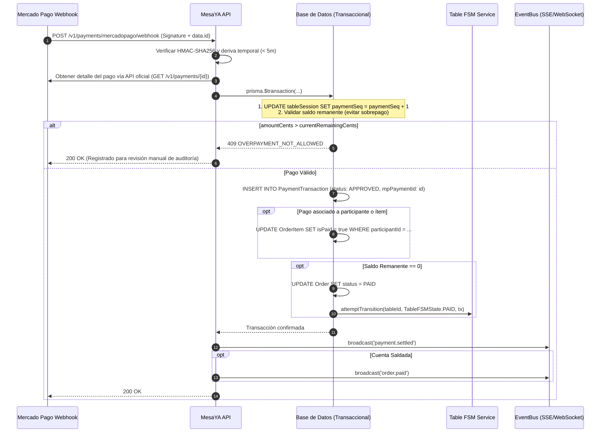

# Contrato Técnico Canónico: Integración Mercado Pago en MesaYA (RTMS)

> **Estado Operativo Actual**: Bloqueado de forma incondicional (`503 DIGITAL_PAYMENTS_UNAVAILABLE`).  
> Este documento establece la arquitectura estricta, los esquemas de datos, la seguridad criptográfica y las garantías transaccionales necesarias para la futura activación del procesador digital Mercado Pago en el ecosistema MesaYA.

---

## 1. Principios Rectores y Dominio de Autoridad

1. **Autoridad Absoluta en Centavos Enteros (`ARS`)**:
   - Todo cálculo contable, monto de comanda, propina, división de cuenta y validación de cobro digital se computa y valida en números enteros en centavos (`amountCents`, `tipCents`, `lineTotalCents`).
   - Queda prohibida la persistencia o comparación de dinero en punto flotante (`Float`/`Double`).
2. **Modelo Multi-Tenant con Credenciales Aisladas**:
   - MesaYA actúa como facilitador técnico. Cada restaurante opera con sus propias credenciales de Mercado Pago vinculadas vía OAuth.
   - Los tokens `access_token` y `refresh_token` se almacenan cifrados con **AES-256-GCM** en la tabla `RestaurantPaymentCredentials`.
3. **Serialización Fuerte de Transacciones**:
   - Todo impacto financiero concurrente (sea presencial o webhook de Mercado Pago) debe incrementar atómicamente el contador `paymentSeq` de la sesión de mesa (`TableSession`), forzando un bloqueo de fila a nivel de base de datos (`UPDATE ... paymentSeq = paymentSeq + 1`).
4. **Propina Desacoplada e Intocable**:
   - Las propinas (`tipCents`) se segregan contablemente del consumo gastronómico (`amountCents`). Nunca computan para saldar la deuda de la mesa ni se ven afectadas por divisiones de platos.

---

## 2. Derivación Determinista de Claves de Idempotencia

Para evitar pagos duplicados, cobros fantasmas por pérdida de conexión y reintentos desordenados de clientes o webhooks, la clave de idempotencia sigue el patrón canónico:

```
mp_pref_{restaurantId}_{tableSessionId}_{participantId}_{splitRevision}_{attemptTimestamp}
```

### Reglas de Unicidad y Concurrencia
- **Fingerprint Inmutable**: La clave se almacena en el campo único `PaymentTransaction.idempotencyKey`.
- **Validación Estricta de Reuso**:
  Si una solicitud entrante utiliza una `idempotencyKey` existente, el servidor valida:
  - Mismo `tableSessionId`.
  - Mismo `amountCents` y `tipCents`.
  - Mismo `method`.
  - Mismo `participantId`.
  Si los parámetros coinciden exactamente, se devuelve la transacción existente con status `200 OK` y flag `duplicate: true`.  
  Si existe cualquier discrepancia en los importes o destino, se rechaza inmediatamente con `409 Conflict` (`IDEMPOTENCY_CONFLICT`).

---

## 3. Webhooks de Mercado Pago: Seguridad y Reconciliación

### 3.1 Endpoint y Autenticación Criptográfica
- **Ruta Oficial**: `POST /v1/payments/mercadopago/webhook`
- **Cabeceras Requeridas**:
  - `x-signature`: Formato `ts=[timestamp],v1=[hash_hmac_sha256]`
  - `x-request-id`: UUID generado por Mercado Pago.

### 3.2 Protocolo de Verificación HMAC-SHA256
```typescript
import crypto from 'crypto';

export function verifyMercadoPagoSignature(params: {
  xSignatureHeader: string;
  requestId: string;
  dataId: string;
  webhookSecret: string;
}): boolean {
  const parts = Object.fromEntries(
    params.xSignatureHeader.split(',').map((kv) => kv.split('='))
  );

  const ts = parts['ts'];
  const hash = parts['v1'];

  if (!ts || !hash) return false;

  // 1. Mitigación de Ataques de Replay: tolerancia máxima de 5 minutos (300.000 ms)
  const currentTime = Date.now();
  const requestTime = parseInt(ts, 10) * 1000;
  if (Math.abs(currentTime - requestTime) > 300000) {
    return false;
  }

  // 2. Construcción de plantilla según especificación oficial de Mercado Pago
  const manifest = `id:${params.dataId};request-id:${params.requestId};ts:${ts};`;

  // 3. Verificación criptográfica en tiempo constante (evita timing attacks)
  const computedHash = crypto
    .createHmac('sha256', params.webhookSecret)
    .update(manifest)
    .digest('hex');

  return crypto.timingSafeEqual(
    Buffer.from(computedHash, 'utf-8'),
    Buffer.from(hash, 'utf-8')
  );
}
```

### 3.3 Deduplicación y Reintentos del Webhook
- Las notificaciones entrantes consultan la tabla `RateLimitBucket` o el ID único del evento `data.id`.
- Si el evento ya fue procesado (`status: 'APPROVED'` o `status: 'REFUNDED'`), se responde de forma inmediata con `200 OK` sin reprocesar la lógica contable.

---

## 4. Flujo Transaccional de Liquidación y FSM

Al recibir la confirmación de un pago aprobado (`status === 'approved'`):



---

## 5. Protocolo de Reversiones y Contracargos (Refunds)

En caso de recibir una notificación de reembolso (`payment.refunded`) o cancelación administrativa:

1. **Validación de Rol y Estado**:
   - En reversión presencial: Restringido estrictamente a personal con rol `MANAGER`.
   - En webhook: Requiere coincidencia estricta del `mpPaymentId` previamente aprobado.
2. **Trazabilidad de Auditoría Inmutable**:
   - Se actualiza la fila existente en `PaymentTransaction`:
     - `status = 'REFUNDED'`
     - `reversalReason = 'Mercado Pago Refund: ...'` o motivo ingresado por el encargado.
     - `reversalStaffId = [id del manager o 'SYSTEM_MP_WEBHOOK']`
     - `reversalAt = NOW()`
3. **Restauración Atómica del Estado**:
   - Si la orden estaba en `PAID`, se reabre a `SERVED`.
   - Los ítems cubiertos por el pago se marcan nuevamente con `isPaid = false`.
   - Si la mesa estaba en `PAID`, se ejecuta una transición de restauración autorizada (`isOverride: true`) a `EATING`, devolviendo la mesa al flujo operativo de salón sin pérdida de comandas ni discrepancias contables.

---

## 6. Códigos de Error Normalizados

| Código HTTP | Código de Error | Causa y Acción Operativa |
|---|---|---|
| `400` | `INVALID_SIGNATURE` | Cabecera `x-signature` ausente o no coincide con HMAC-SHA256. |
| `400` | `SIGNATURE_EXPIRED` | La marca de tiempo del webhook supera los 5 minutos de antigüedad. |
| `409` | `IDEMPOTENCY_CONFLICT` | Reuso de clave con importe, participante o sesión distinta. |
| `409` | `OVERPAYMENT_NOT_ALLOWED` | El monto notificado excede el saldo deudor actual de la sesión. |
| `409` | `BILL_ALREADY_PAID` | La mesa ya fue liquidada al 100% por otro medio de pago. |
| `503` | `DIGITAL_PAYMENTS_UNAVAILABLE` | Estado preventivo: pagos digitales desactivados hasta habilitación del módulo en el restaurante. |
