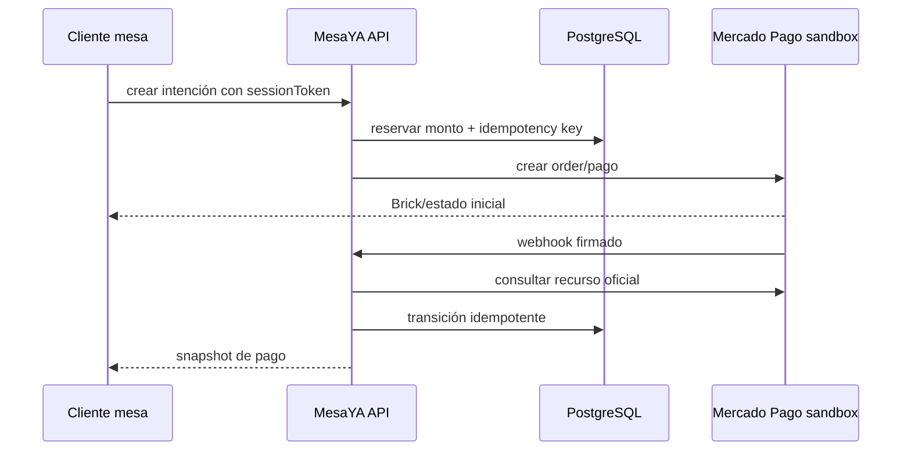

# Etapa 04 — Pago digital autónomo en sandbox

## Objetivo

Permitir que el comensal pague una cuenta completa desde la mesa con Mercado Pago en modo de prueba, con confirmación server-to-server.

## Decisión técnica

Usar la solución vigente de Mercado Pago para Argentina y confirmar la elección al comenzar la etapa. La documentación actual presenta Checkout API vía Orders para pagos online y presenciales, exige `X-Idempotency-Key`, y ofrece Checkout Bricks para capturar datos en el cliente sin manejar datos de tarjeta en MesaYA.

Referencias oficiales:

- https://www.mercadopago.com.ar/developers/es/docs/checkout-api-orders/overview
- https://www.mercadopago.com.ar/developers/es/reference/online-payments/checkout-api/create-order/post
- https://www.mercadopago.com.ar/developers/es/docs/checkout-bricks/payment-brick/introduction
- https://www.mercadopago.com.ar/developers/es/docs/checkout-api-orders/notifications
- https://www.mercadopago.com.ar/developers/es/docs/checkout-api-orders/resources/test-accounts
- https://www.mercadopago.com.ar/developers/es/docs/checkout-api-orders/resources/credentials

## Arquitectura

## Trabajo

1. Crear intención de pago desde una orden cerrada al cambio y perteneciente a la sesión.
2. Congelar monto, moneda, ítems, propina y versión de orden.
3. Mantener Access Token sólo en backend y Public Key en cliente.
4. Encriptar credenciales por restaurante y definir rotación.
5. Enviar idempotency key estable a Mercado Pago.
6. Validar firma del webhook, consultar el recurso a MP y aceptar transiciones repetidas/fuera de orden.
7. El navegador muestra pendiente hasta que API confirme; nunca cambia a PAID por callback del Brick.
8. Implementar expiración, rechazo, cancelación, reintento y conciliación manual.
9. Actualizar Order, PaymentTransaction, FSM y OccupancySession en una transición consistente.
10. Exponer estado de integración en admin y habilitar DIGITAL_MP sólo cuando el sandbox pase el gate.

## Casos obligatorios

- aprobado, pendiente y rechazado;
- doble toque y reintento de red;
- webhook duplicado, tardío y fuera de orden;
- importe de orden cambia durante checkout;
- token de otra mesa;
- firma inválida;
- caída de MP después de crear la intención;
- conciliación tras reinicio del serverless.

## Aceptación

Dos cuentas de prueba, vendedor y comprador del mismo país, completan el flujo. Base, API de MP, orden y UI concuerdan después de cada caso. No se usan credenciales productivas.

