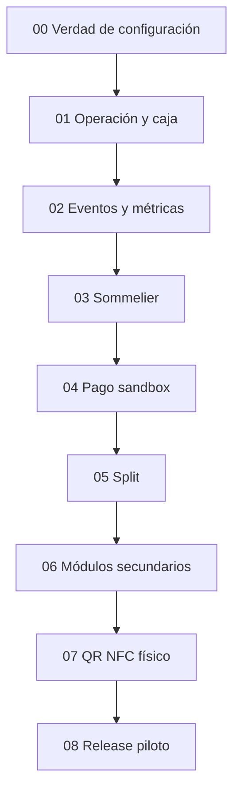

# Mapa para tablero Miro

Este archivo define marcos, tarjetas y conexiones. Puede copiarse a Miro conservando un frame por sección.

## Frame 1 — Estado actual

### Verde: base utilizable

- API Vercel responde y Supabase está conectado.
- Panel admin con autenticación de manager.
- Turnos y sesiones por mesa.
- URL QR estable y token rotativo.
- Llamados y panel staff por polling.
- Pedido, validación y KDS.
- Carta y CRUD de menú.

### Amarillo: parcial

- Operación presencial sin pantalla de caja.
- Pedidos multiusuario sin ensayo físico.
- Plano/FSM con errores silenciosos.
- Waitlist sólo staff.
- Upsell sólo backend.
- Personal sin ciclo de vida completo.

### Rojo: no funciona o induce a error

- Pago autónomo activable pero bloqueado por 503.
- Split activable pero bloqueado por 503.
- Sommelier repite recomendaciones sin entender intención.
- Embudo con tiempos prefijados.
- NPS perfecto sin respuestas.
- RevPASH/facturación con cifras estimadas sin etiqueta.
- Pre-order y Rewards presentados como módulos terminados.

## Frame 2 — Dependencias

## Frame 3 — Camino del comensal

`QR/NFC -> sesión válida -> carta -> consulta IA -> carrito -> envío -> cocina -> servido -> cuenta -> pago/split -> feedback -> salida`

Colocar debajo de cada paso cuatro tarjetas: interfaz, API, dato, evidencia. Si una falta, el paso no se marca terminado.

## Frame 4 — Camino del local

`Login manager -> abrir turno -> staff login -> ocupar mesa -> atender llamados -> validar pedido -> cocina -> servir -> cobrar -> liberar/limpiar -> cerrar turno -> revisar métricas`

## Frame 5 — Pausas

- **PAUSA A:** recorrido presencial completo sin dinero digital.
- **PAUSA B:** revisión humana de métricas y 20 consultas del Sommelier.
- **PAUSA C:** conciliación de pagos sandbox, reintentos y split concurrente.
- **PAUSA D:** jornada física con tags, teléfonos y personal.

## Frame 6 — Definición GO

- Cero funciones habilitadas sin recorrido completo.
- Cero cifras inventadas presentadas como reales.
- Cero pagos aprobados sólo por estado del navegador.
- Cero secretos en cliente, Git o evidencia.
- QR y NFC abren la misma mesa en al menos iOS y Android.
- Rollback ensayado y datos del piloto recuperables.

