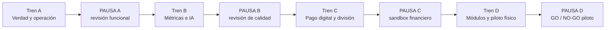

# Plan integral de recuperación y piloto real — MesaYA

Fecha de auditoría: 2026-09-06  
Alcance: producto completo, entorno piloto en Vercel y Supabase, QR/NFC y operación de un local.  
Estado: plan preparado; ninguna etapa de implementación iniciada.

## Conclusión ejecutiva

MesaYA tiene una base operativa valiosa: API y PostgreSQL están conectados, el panel de administración carga, existen turnos y sesiones, el QR estable resuelve una mesa, los llamados llegan al panel de mozos y el circuito de comanda/cocina tiene implementación real. El problema principal ya no es sólo el despliegue. El producto mezcla funciones terminadas, funciones parciales y controles que guardan una configuración sin activar la capacidad prometida.

La decisión es trabajar en cuatro trenes de cambios, cada uno con revisión y pausa. `main` y los alias actuales del piloto quedan estables mientras se trabaja en una rama. Cada etapa entrega evidencia local; cada tren se valida en Preview y recién después se promueve al entorno piloto. Los pagos se prueban con credenciales y usuarios de prueba de Mercado Pago. No se procesa dinero real durante este plan.

## Orden de ejecución

| Etapa | Resultado | Tren | Despliegue |
|---|---|---|---|
| 00 | Contrato funcional, baseline y configuración honesta | A | Sin deploy |
| 01 | Ciclo operativo completo y caja presencial utilizable | A | Preview conjunta |
| 02 | Métricas basadas en hechos, con muestras y estados sin datos | B | Sin deploy |
| 03 | Sommelier relevante y limitado a la carta real | B | Preview conjunta |
| 04 | Pago digital autónomo con Mercado Pago en sandbox | C | Preview financiera aislada |
| 05 | Cuenta dividida por partes y por ítems, con concurrencia | C | Preview financiera aislada |
| 06 | Upsell, propinas, reseñas, espera y Rewards completos o retirados | D | Preview conjunta |
| 07 | Ensayo QR/NFC y operación presencial del local | D | Entorno piloto |
| 08 | Promoción agrupada, observación y rollback | D | Piloto estable |

## Reglas de ejecución

1. Trabajar una sola etapa por vez siguiendo [CONTROL.md](CONTROL.md).
2. Crear una rama con prefijo `codex/`; no implementar directamente sobre `main`.
3. No cambiar Supabase real con `db push`, `migrate reset` o seeds. Las migraciones se prueban primero en una base desechable.
4. No habilitar un interruptor si frontend, API, persistencia, permisos y prueba de punta a punta no existen.
5. No mostrar estimaciones como datos reales. Cada métrica debe indicar fuente, rango, cantidad de muestras y si es estimada.
6. No marcar un pago como aprobado por la respuesta del navegador. La confirmación llega por backend y se reconcilia con Mercado Pago.
7. Al terminar una etapa: reporte, revisión, actualización de CONTROL y parada. No encadenar la siguiente.
8. Al terminar un tren: Preview de los tres clientes/API afectados, recorrido manual y decisión explícita antes de promover.

## Archivos del plan

- [AUDITORIA-FUNCIONAL.md](AUDITORIA-FUNCIONAL.md): qué funciona, qué es parcial y qué es engañoso.
- [CONTROL.md](CONTROL.md): estado, dependencias, responsables y evidencia.
- [MAPA-MIRO.md](MAPA-MIRO.md): estructura visual lista para pasar a un tablero Miro.
- [ETAPA-00-VERDAD-Y-BASELINE.md](ETAPA-00-VERDAD-Y-BASELINE.md)
- [ETAPA-01-CICLO-OPERATIVO-Y-CAJA.md](ETAPA-01-CICLO-OPERATIVO-Y-CAJA.md)
- [ETAPA-02-METRICAS-CONFIABLES.md](ETAPA-02-METRICAS-CONFIABLES.md)
- [ETAPA-03-SOMMELIER-DE-CALIDAD.md](ETAPA-03-SOMMELIER-DE-CALIDAD.md)
- [ETAPA-04-PAGO-DIGITAL-SANDBOX.md](ETAPA-04-PAGO-DIGITAL-SANDBOX.md)
- [ETAPA-05-CUENTA-DIVIDIDA.md](ETAPA-05-CUENTA-DIVIDIDA.md)
- [ETAPA-06-MODULOS-SECUNDARIOS.md](ETAPA-06-MODULOS-SECUNDARIOS.md)
- [ETAPA-07-PILOTO-FISICO.md](ETAPA-07-PILOTO-FISICO.md)
- [ETAPA-08-RELEASE-Y-OBSERVACION.md](ETAPA-08-RELEASE-Y-OBSERVACION.md)

## Definición de “funciona”

Una función funciona únicamente cuando se cumplen las cinco capas:

| Capa | Evidencia mínima |
|---|---|
| Interfaz | El usuario encuentra la acción, comprende su estado y obtiene error accionable |
| API | Contrato, permisos, validación, idempotencia y errores específicos |
| Datos | Persistencia coherente y migración repetible |
| Operación | Staff/manager puede completar o recuperar el flujo |
| Pruebas | Caso feliz, rechazo, reintento y recorrido manual en Preview |

Compilar o guardar una bandera no alcanza para clasificar una capacidad como funcional.

