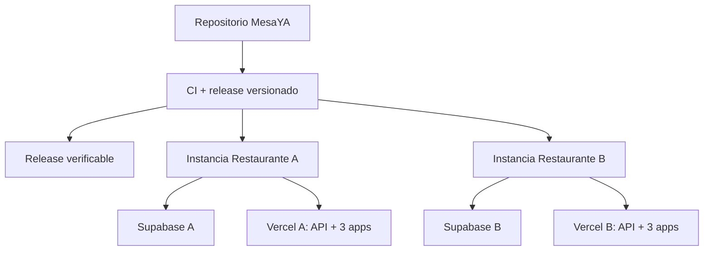

# MesaYA — plan de producto base distribuible

Fecha: 2026-09-07  
Estado: **LÍNEA BASE CLONABLE — VERIFICACIÓN LOCAL CONTINUA**  
Objetivo: construir una base completa, coherente, versionada e instalable para restaurantes reales.

## Nueva definición del producto

MesaYA se organiza alrededor de una release base reproducible. Las pruebas de versión se ejecutan en instalaciones locales desechables y cada restaurante se certifica después con su propia infraestructura, sin copiar datos entre instancias.

El producto base debe incluir recorridos completos para:

`QR/NFC -> sesión -> carta -> carrito/llamado -> pantalla compartida de salón -> cocina -> caja -> liberación -> métricas`

y módulos estabilizados y activables por configuración, para Sommelier, upselling, propinas, reseñas, fila virtual, pre-order y Rewards. Mercado Pago queda como opción informativa; la división digital de cuenta y los respaldos externos son extensiones posteriores con gates propios.

## Modelo comercial/técnico recomendado

Un único código fuente y una única línea de releases. Cada restaurante recibe una instancia aislada:

- un proyecto Supabase propio;
- un conjunto de proyectos Vercel propio para API, comensal, salón y administración;
- secretos, dominios, branding, carta y configuración propios;
- migraciones y versión de aplicación registradas;
- backups, monitoreo y rollback propios.

La ruta normal usa la release base y expresa las diferencias mediante configuración, temas, catálogo, reglas y feature flags con contratos reales. Cuando un local boutique necesita código propio, puede usar un override aislado (rama/commit y despliegues propios) registrado en su manifiesto. Ese override no se mezcla automáticamente con otros locales; si la mejora sirve al producto, se promueve de forma explícita a la línea base.

## Decisiones estructurales

1. **Single codebase, isolated instances.** El aislamiento principal es infraestructura por restaurante; `restaurantId` se conserva como defensa, compatibilidad y posibilidad futura de grupos.
2. **Single-restaurant mode.** Cada instancia declara un restaurante raíz y rechaza operaciones de otro tenant, incluso si el dato apareciera por error.
3. **Pantalla compartida de salón.** El dispositivo mantiene una sesión de terminal; cada acción sensible identifica al mozo mediante selección rápida + PIN o reautenticación equivalente.
4. **Auditoría por actor.** Nunca se usa una cuenta genérica “Mozo”. Llamados, comandas, descuentos, cobros y cierres guardan terminal, actor y hora.
5. **Capacidades completas o no disponibles.** Una feature activable tiene UI, API, persistencia, permisos, operación, diagnóstico y pruebas E2E.
6. **Código base primero.** Toda etapa se prueba localmente y en una base desechable antes de publicar una release. La certificación de cada local es un gate posterior de infraestructura y operación, no una condición para que el código base sea clonable.
7. **Customización aislada y trazable.** Branding y reglas siguen siendo datos cuando alcanza. Un cambio de código específico usa una rama/commit de override, queda asociado al local y tiene su propio plan de actualización; nunca se parchea sólo en Vercel sin registro.

## Arquitectura objetivo

## Bloques del programa

| Bloque | Etapas | Resultado |
|---|---|---|
| A — Contrato y plataforma | 00–03 | producto definido, configuración honesta e instalación repetible |
| B — Operación central | 04–09 | salón compartido, mesas, pedidos, cocina y caja coherentes |
| C — Experiencia e inteligencia | 10–13 | métricas, Sommelier, venta y feedback completos |
| D — Módulos de expansión | 14–18 | fila, pago, split, Rewards e integraciones completos |
| E — Producto distribuible | 19–22 | seguridad E2E, certificación, release e instalación por local |

El detalle está en [PLAN-POR-ETAPAS.md](PLAN-POR-ETAPAS.md).

## Documentos del plan

- [ARQUITECTURA-DE-INSTANCIAS.md](ARQUITECTURA-DE-INSTANCIAS.md)
- [PANTALLA-COMPARTIDA-SALON.md](PANTALLA-COMPARTIDA-SALON.md)
- [ALCANCE-FUNCIONAL.md](ALCANCE-FUNCIONAL.md)
- [PLAN-POR-ETAPAS.md](PLAN-POR-ETAPAS.md)
- [CONTROL.md](CONTROL.md)
- [GUIA-CLON-Y-RELEASE.md](GUIA-CLON-Y-RELEASE.md)
- [PROTOCOLO.md](PROTOCOLO.md)
- Reportes ejecutados: [reportes/](reportes/)

## Resultado final esperado

Una release base puede instalarse en una cuenta nueva de Supabase y un conjunto nuevo de Vercel sin copiar datos de otra instancia. El instalador configura un restaurante, genera accesos iniciales, ejecuta migraciones, verifica los cuatro artefactos y entrega un manifiesto sin secretos. Si el local requiere código propio, el manifiesto fija la release padre, la rama y el commit del override antes del despliegue. Todas las capacidades declaradas estables pasan su recorrido completo; las no configuradas aparecen como no disponibles, no como rotas.

La evidencia local habilita la clonación del código base. PostgreSQL/Supabase remoto, Vercel, dispositivos físicos y restauración de backup son gates adicionales de cada instancia. Mercado Pago autónomo no forma parte de esta release; sólo se configura como opción informativa.
